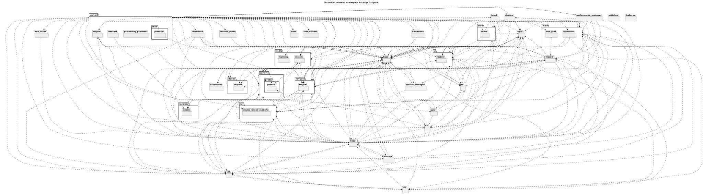
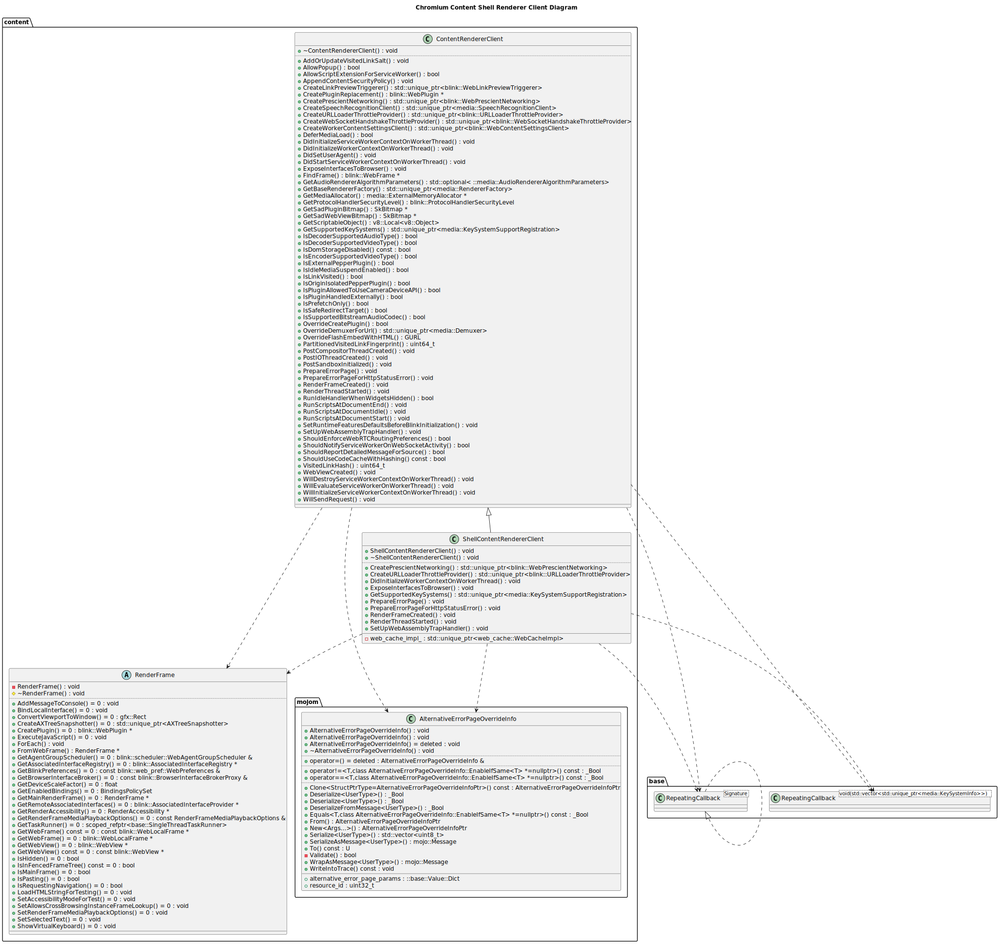
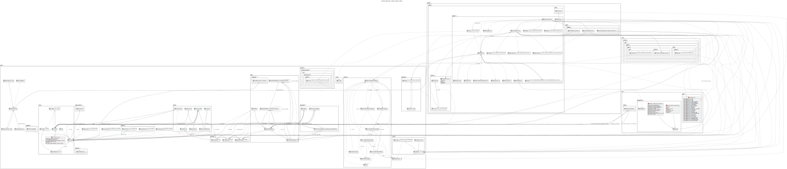
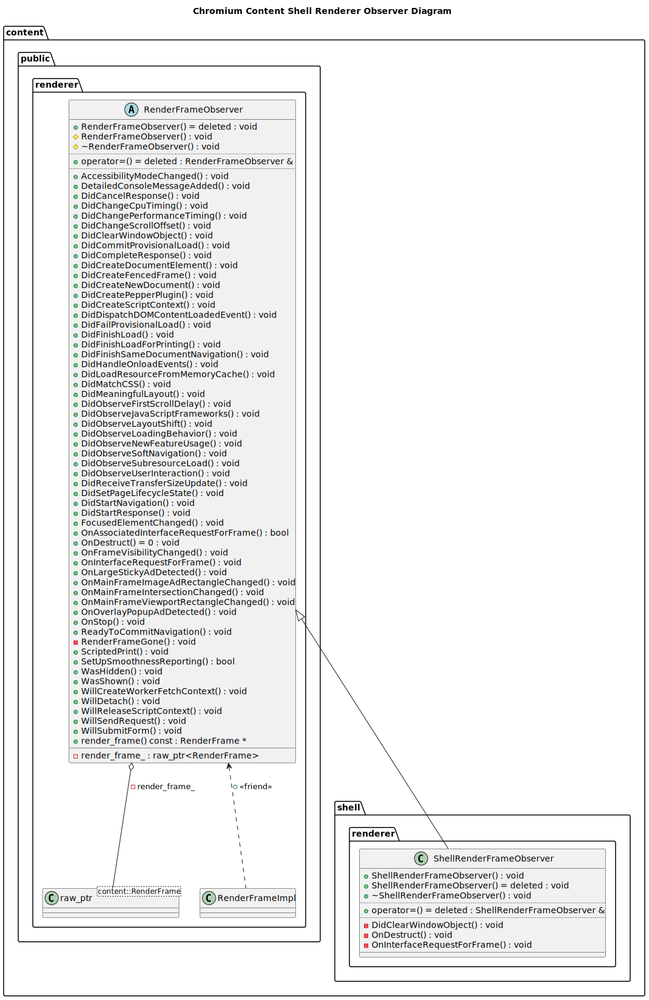
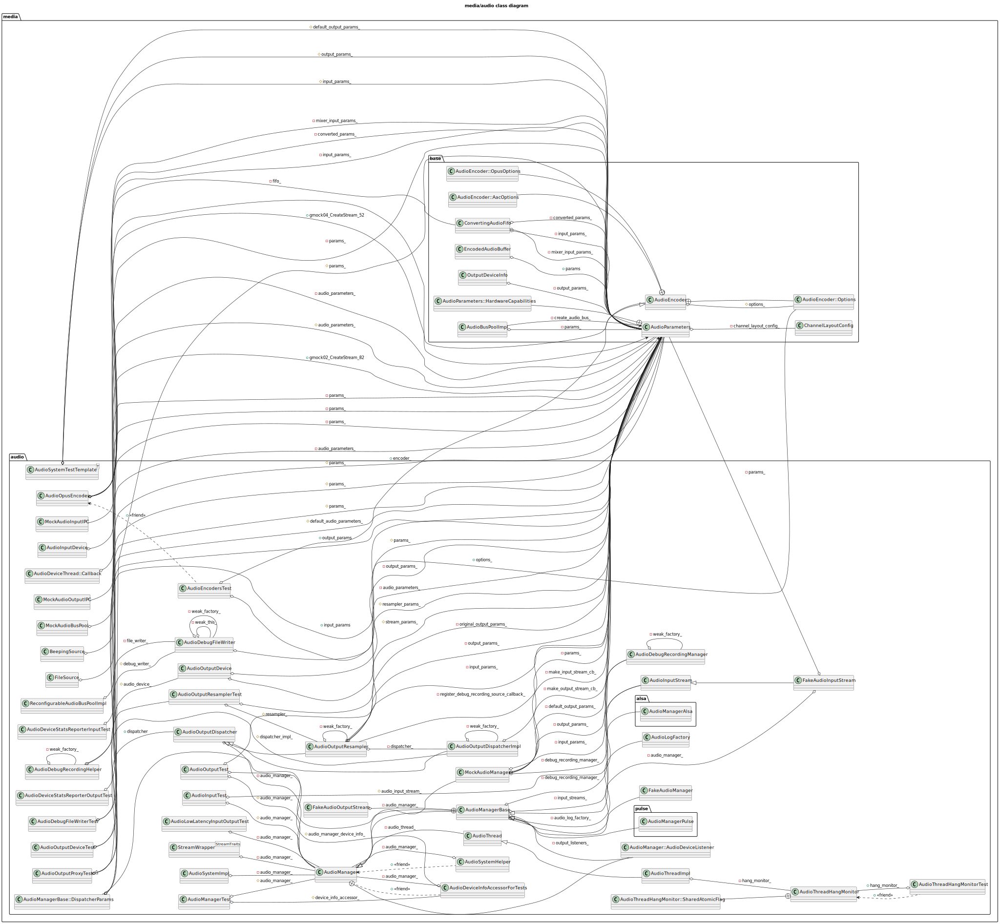
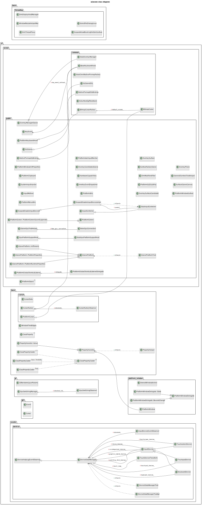
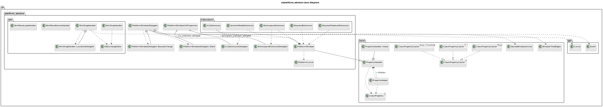
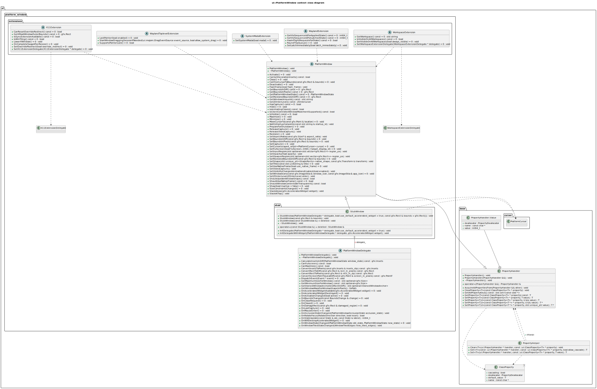

# chromium UML diagrams
## Chromium Content Namespace Package Diagram

## Chromium Content Shell Renderer Client Diagram

## Chromium Content Shell Renderer Observer Diagram

## Chromium Content Shell Renderer Observer Diagram

## media/audio class diagram

## ui/ozone class diagram

## ui/platform_window class diagram

## ui::PlatformWindow context class diagram

