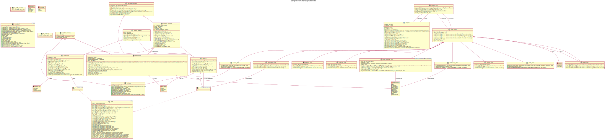
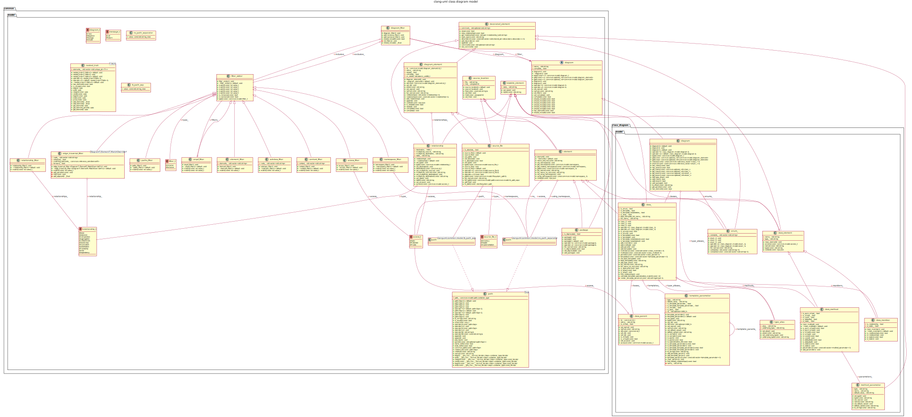
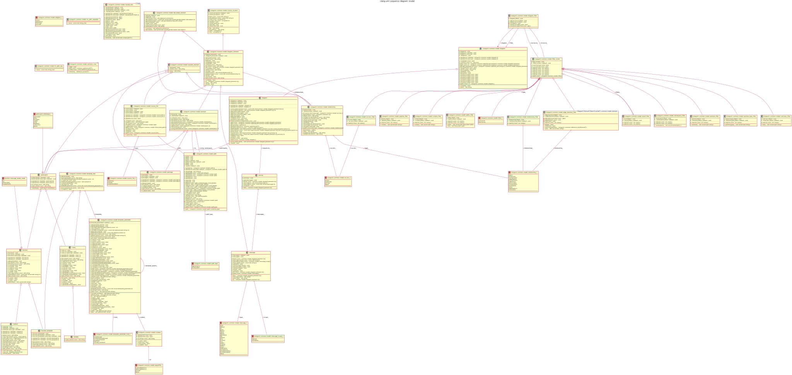
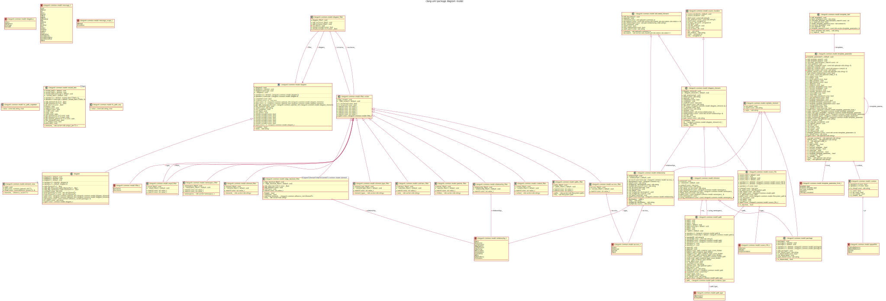
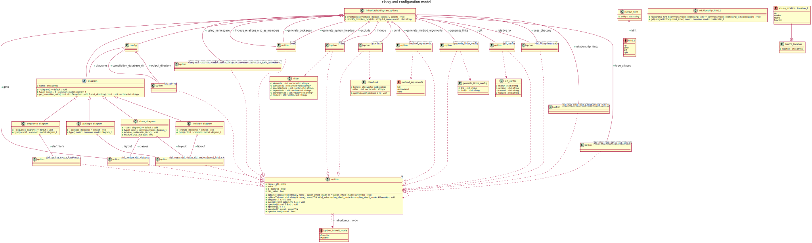
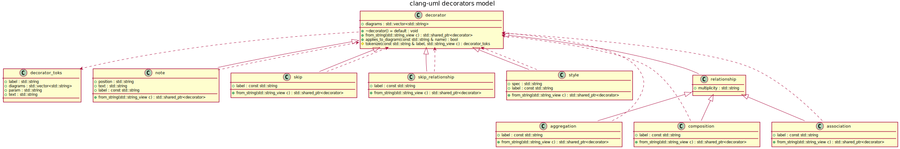
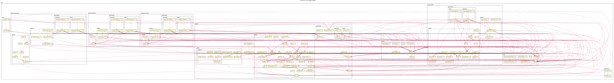
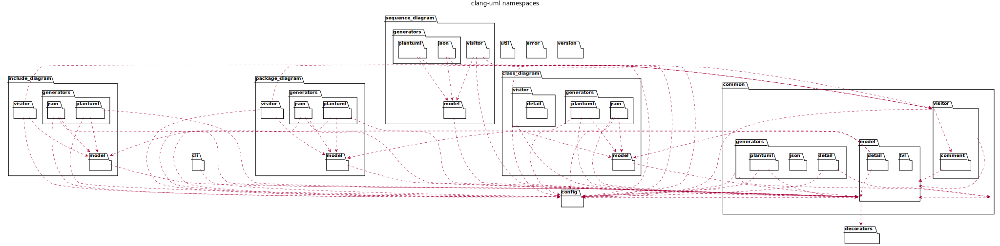

# clang-uml UML diagrams

## Generating diagrams

```bash
make CLANG_UML_BINARY=../../clang-uml/debug/src/clang-uml
```

## Common model class diagram



## Class diagram model class diagram



## Sequence diagram model class diagram



## Package diagram model class diagram



## Config model class diagram



## Decorators model class diagram



## Include graph diagram



## Package diagram


