# clang-uml UML diagrams
## Class diagram TU visitor

## Translation unit AST visitors

## Configuration model

## clanguml::config::config context diagram
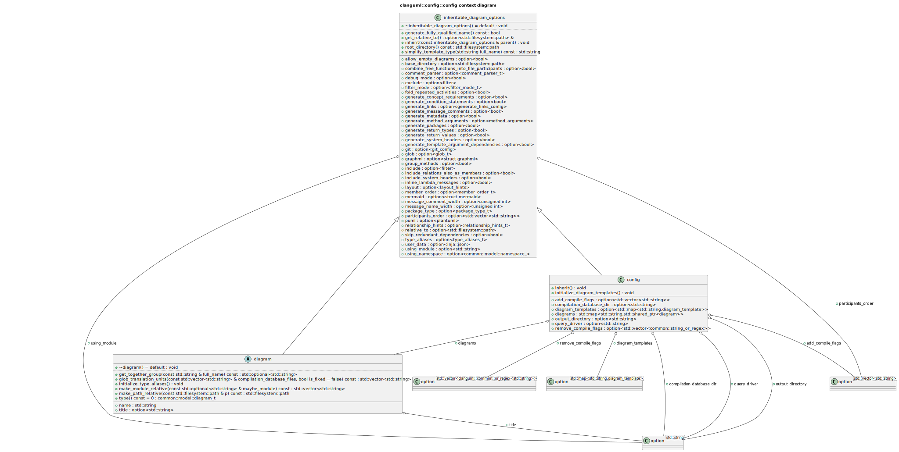

## Compilation database context diagram
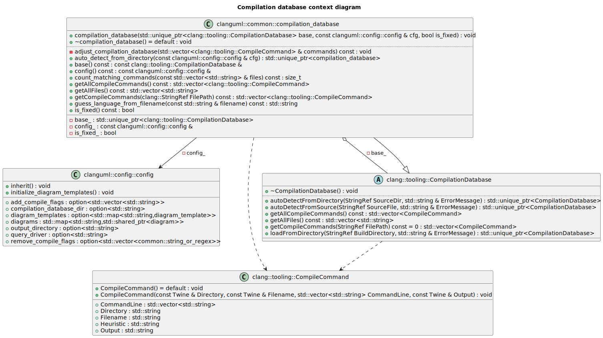

## Configuration model inheritable options context
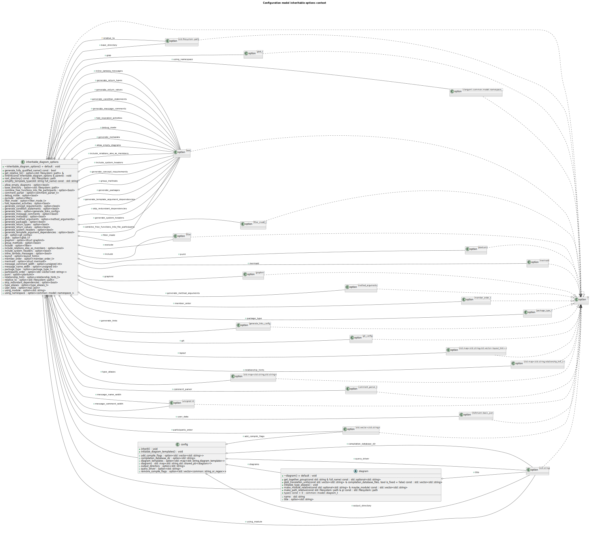

## Configuration model class hierarchy

## Diagram type class hierarchy

## Decorated diagram element class hierarchy

## Stylable diagram element class hierarchy

## Source location model class hierarchy
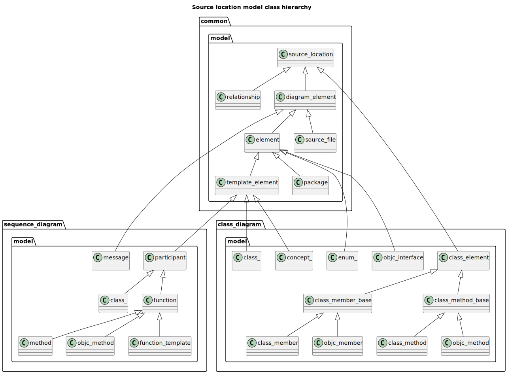

## Diagram filter visitor class hierarchy

## Diagram filter context model
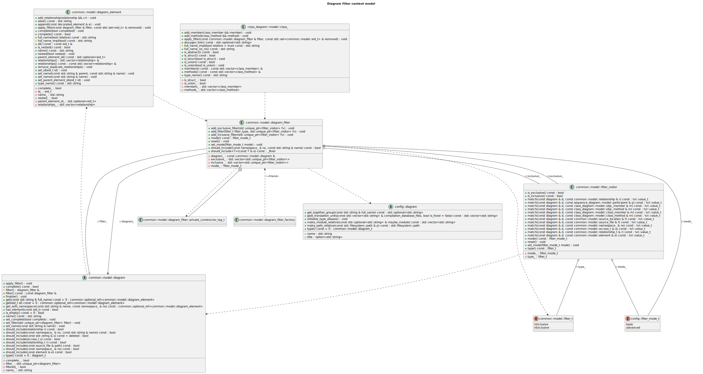

## Nested trait model class hierarchy
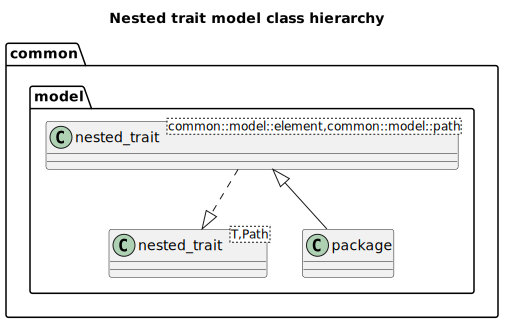

## Package diagram class hierarchy
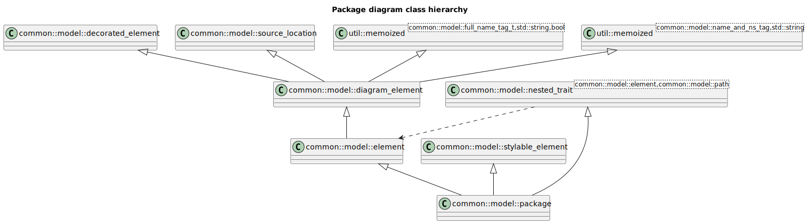

## Source file model class hierarchy
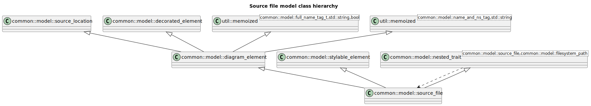

## Template trait diagram element model class hierarchy
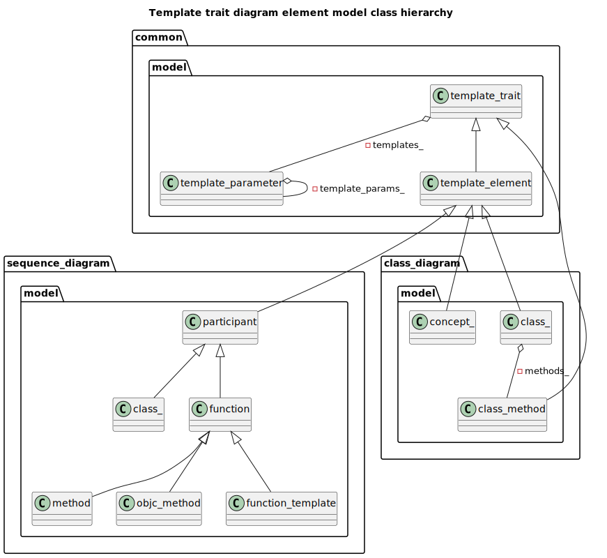

## Comment visitor class hierarchy

## Diagram element decorators model
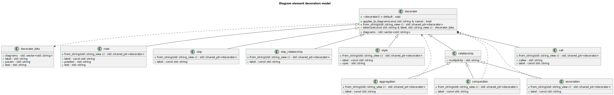

## Relationship model context

## Common diagram model

## Class diagram model

## Diagram element class hierarchy

## Sequence diagram model
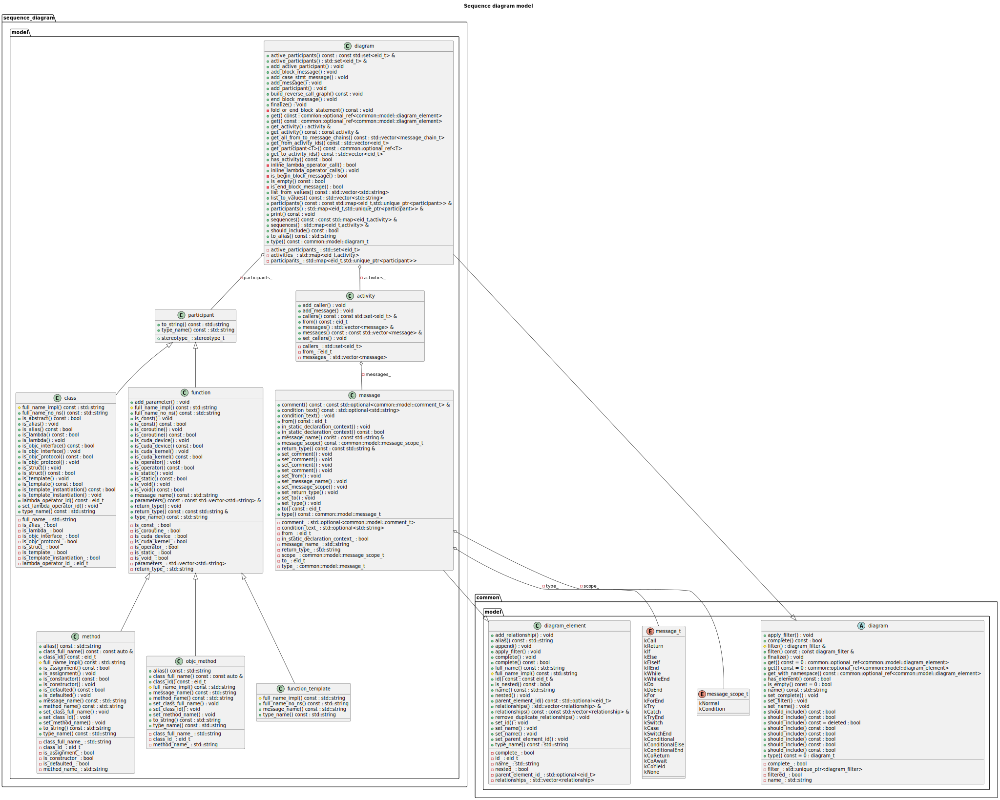

## Package diagram model

## main() function sequence diagram

## Configuration file loading sequence diagram
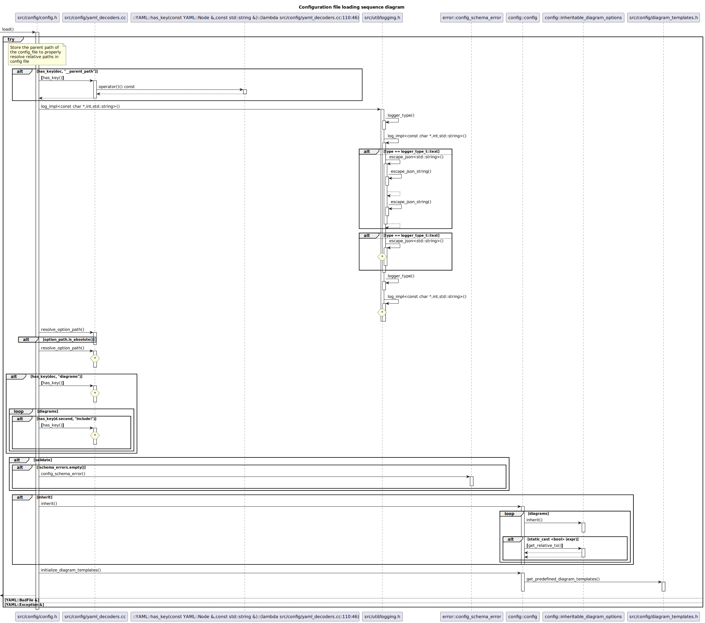

## CLI options handling sequence diagram
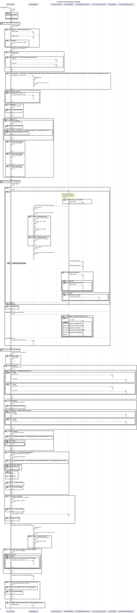

## PlantUML sequence diagram generator sequence diagram
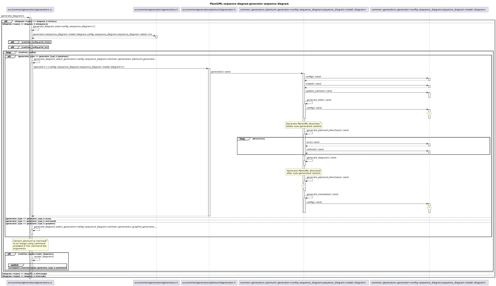

## PlantUML diagram generator sequence diagram
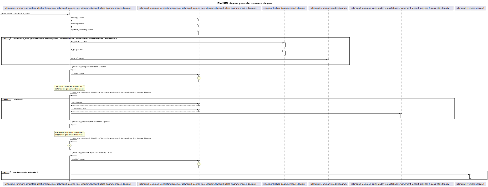

## PlantUML sequence diagram generator sequence diagram

## Diagram element template builder sequence diagram
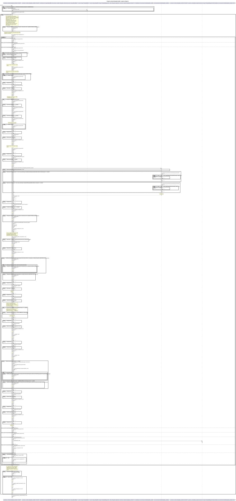

## High-level namespace dependencies in clang-uml

## Include graph

