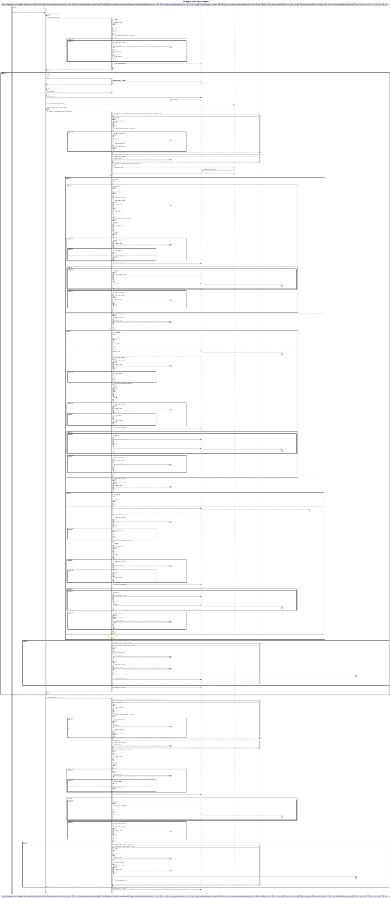

# cpp-standard-library UML diagrams
## std::map emplace() sequence diagram

## std::vector emplace() sequence diagram

## std::list emplace() sequence diagram

## std::map context class diagram

## std::vector context class diagram

## std::list context class diagram

