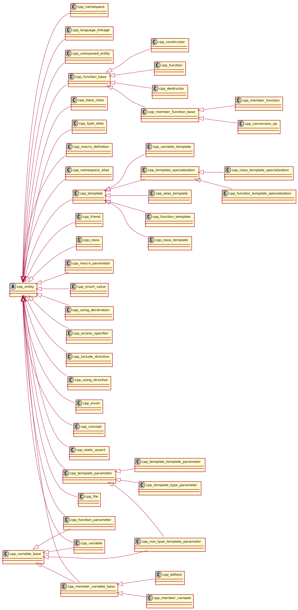
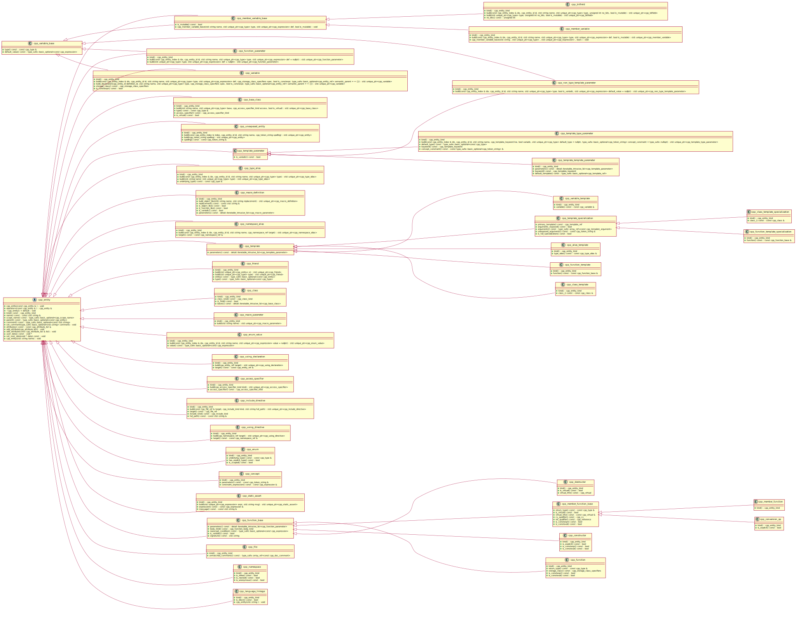
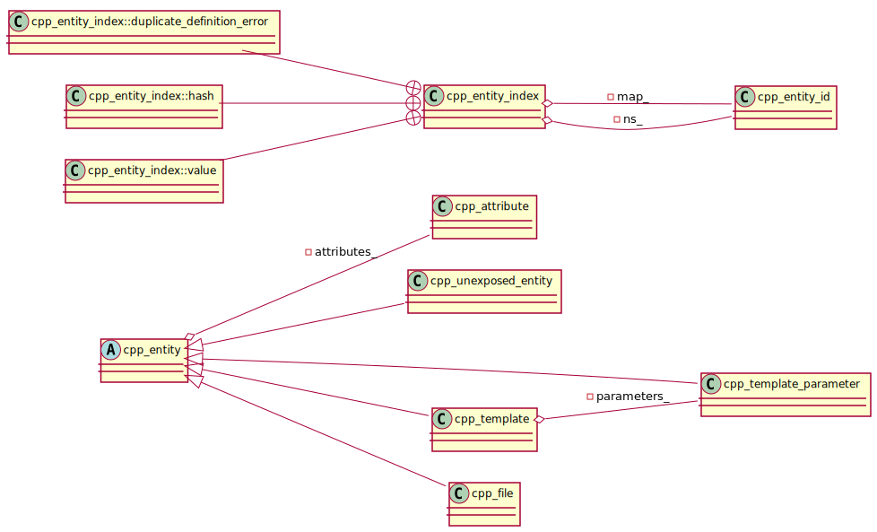
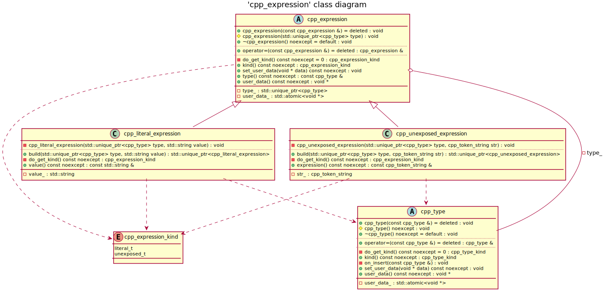
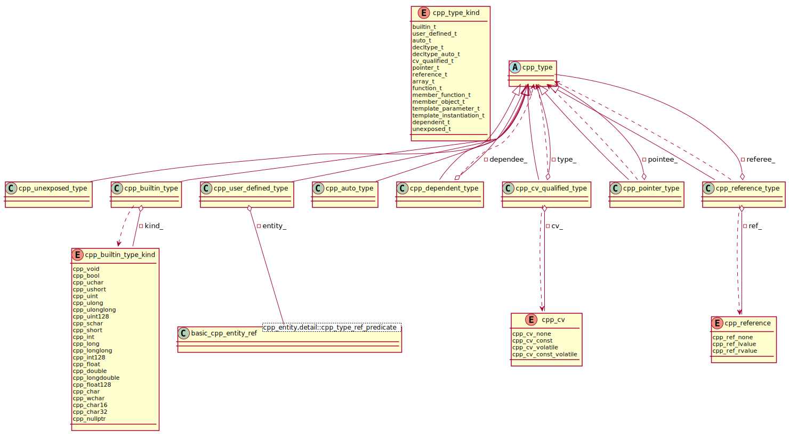
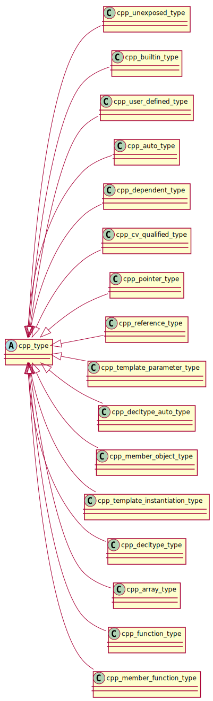
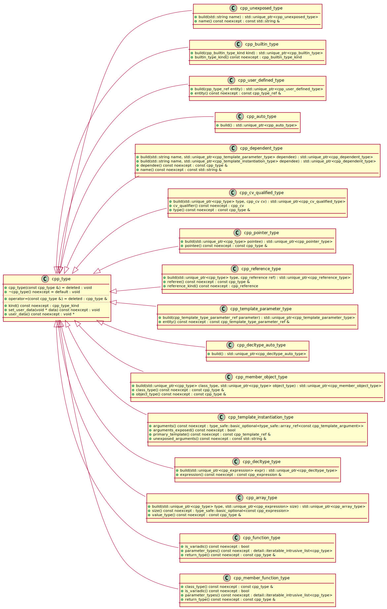

# cppast UML diagrams

## Generating diagrams

```bash
# Checkout and build godot
git clone https://github.com/foonathan/cppast
cd cppast
mkdir _build && cd _build
cmake -DCMAKE_EXPORT_COMPILE_COMMANDS=ON -DCPPAST_BUILD_TEST=OFF ..
# Copy .clang-uml config to godot root directory
cp ../clang-uml-examples/cppast/.clang-uml .
# Create output diagram directory
mkdir puml
# Run clang-uml
clang-uml 
# Generate diagrams
plantuml -tsvg puml/*.puml
```

## 'cpp_entity' class hierarchy



## 'cpp_entity' class hierarchy with public members



## 'cpp_entity_index' class diagram



## 'cpp_expression' class diagram



## 'cpp_type' class diagram



## 'cpp_type' class hierarchy diagram



## 'cpp_type' class hierarchy diagram with public members



## Include graph diagram


