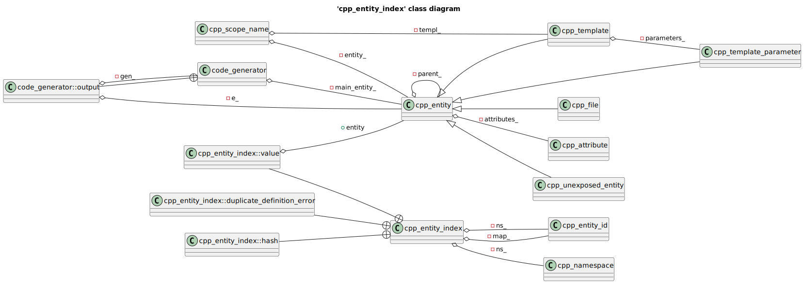
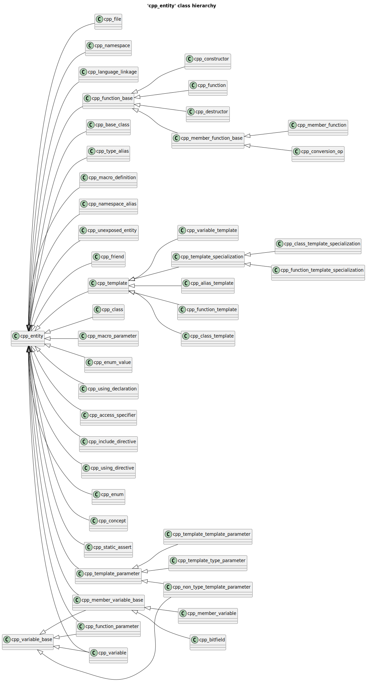
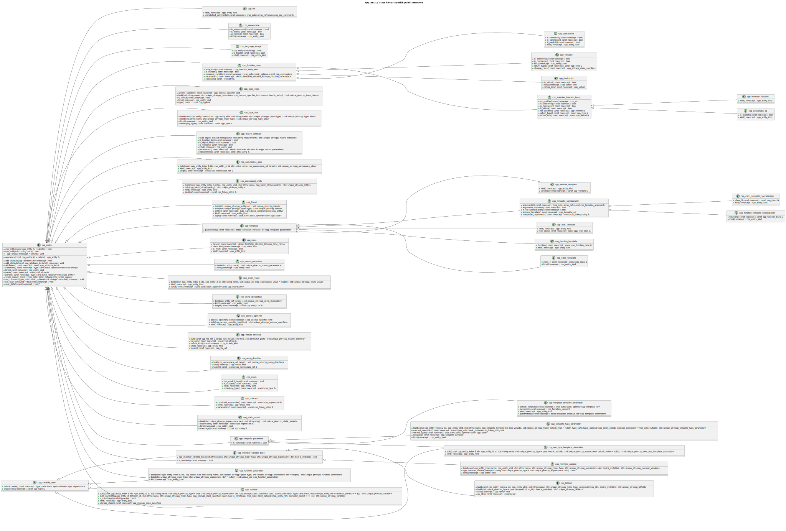
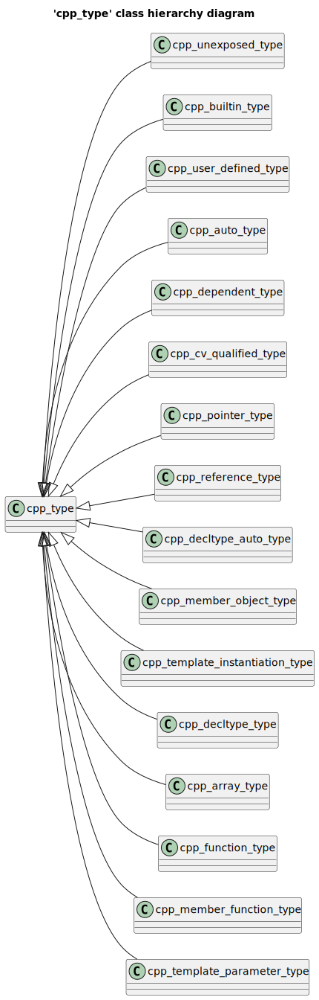
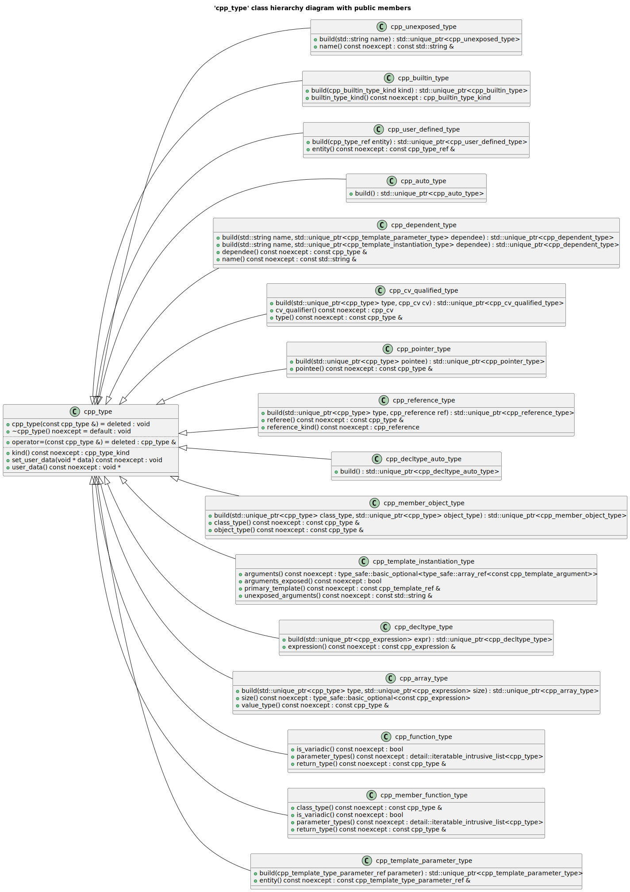

# cppast UML diagrams
## 'cpp_expression' class diagram

## 'cpp_type' class diagram

## 'cpp_entity_index' class diagram

## 'cpp_entity' class hierarchy

## 'cpp_entity' class hierarchy with public members

## 'cpp_type' class hierarchy diagram

## 'cpp_type' class hierarchy diagram with public members

## Include graph diagram

