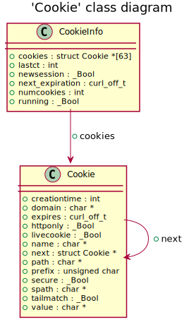
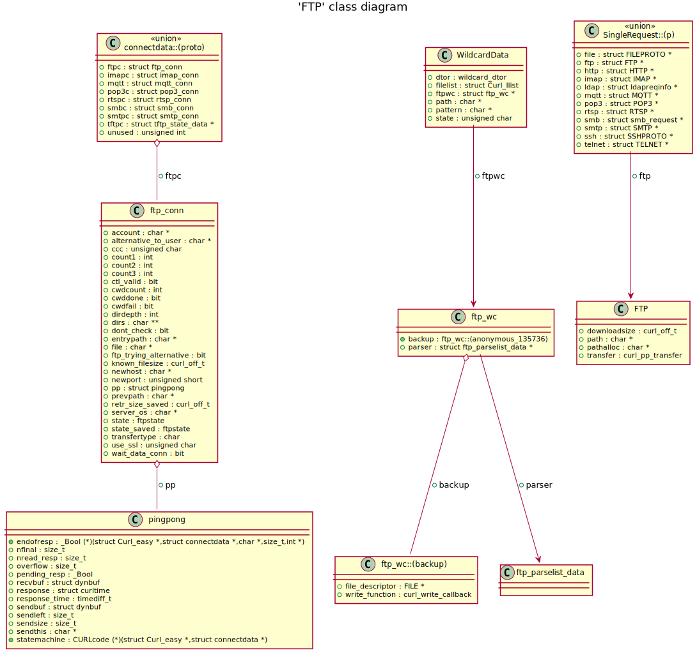
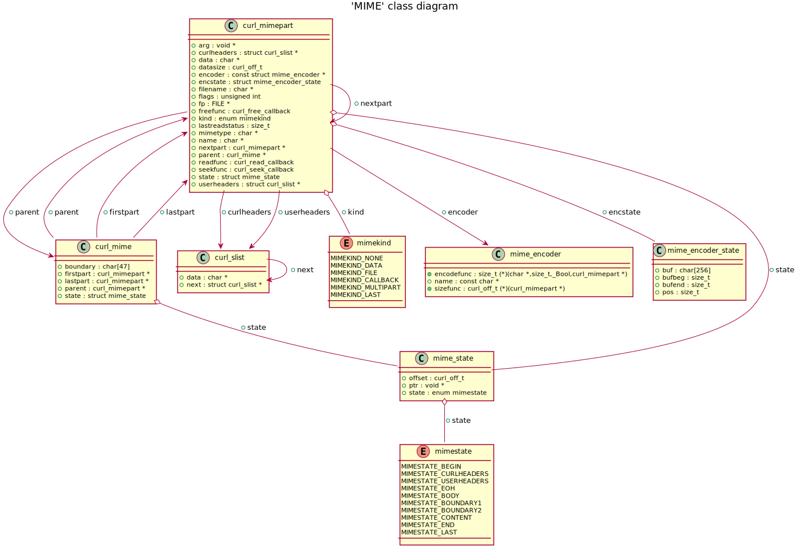
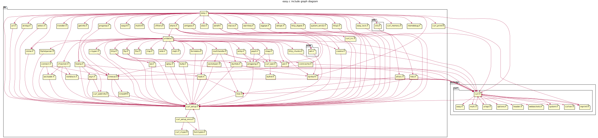
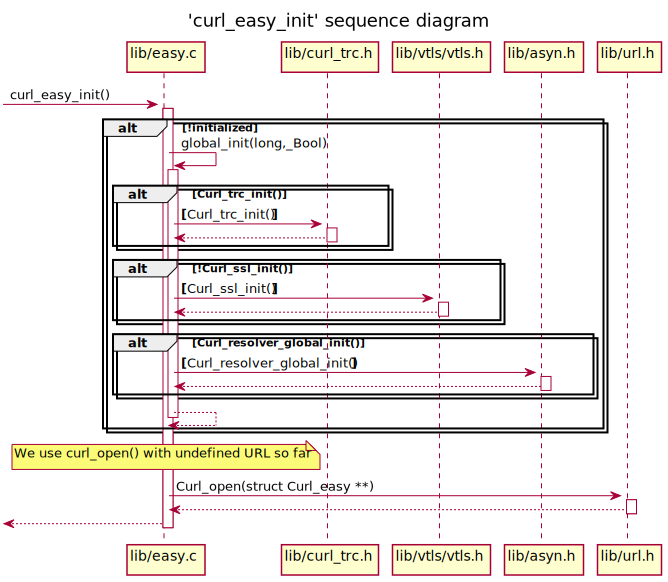
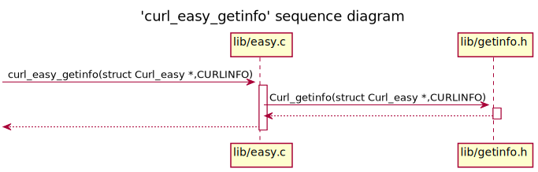
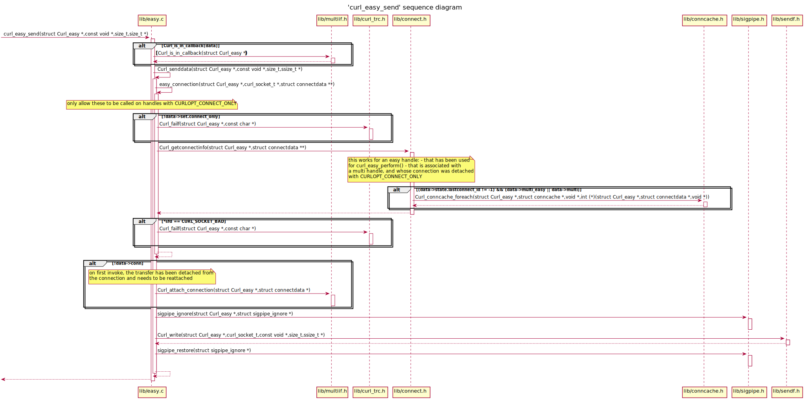
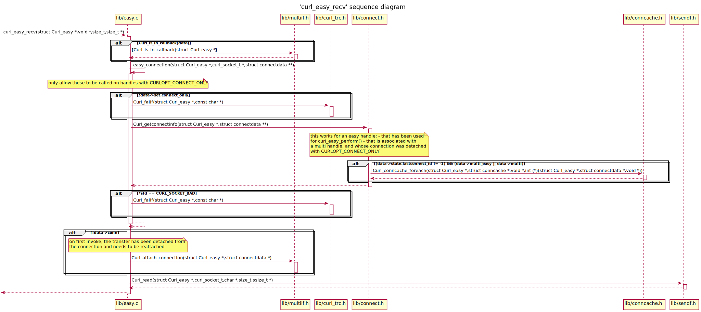

# curl UML diagrams
## 'Cookie' class diagram

## 'FTP' class diagram

## 'MIME' class diagram

## easy.c include graph diagram

## 'curl_easy_init' sequence diagram

## 'curl_easy_getinfo' sequence diagram

## 'curl_easy_send' sequence diagram

## 'curl_easy_recv' sequence diagram

