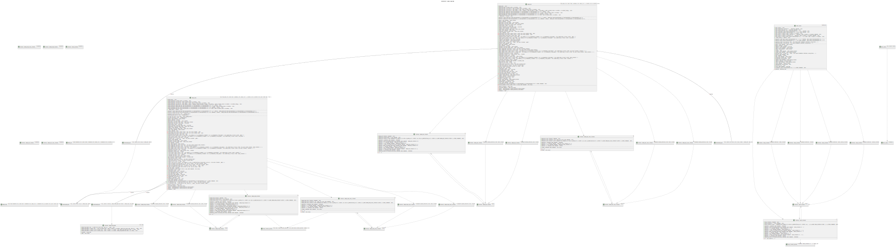
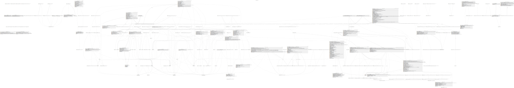
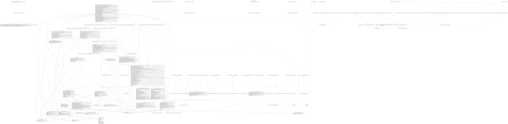
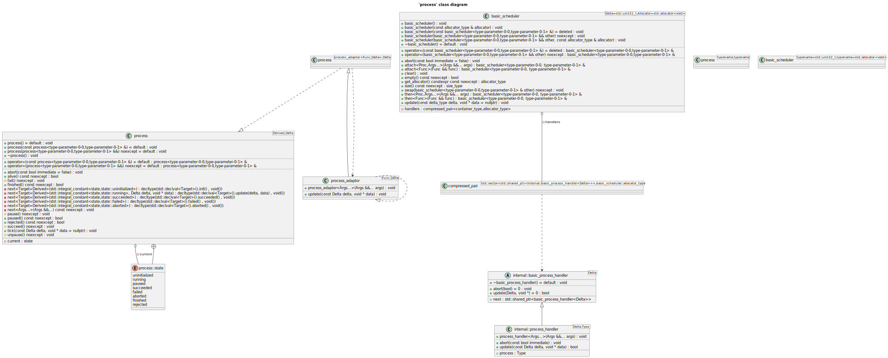
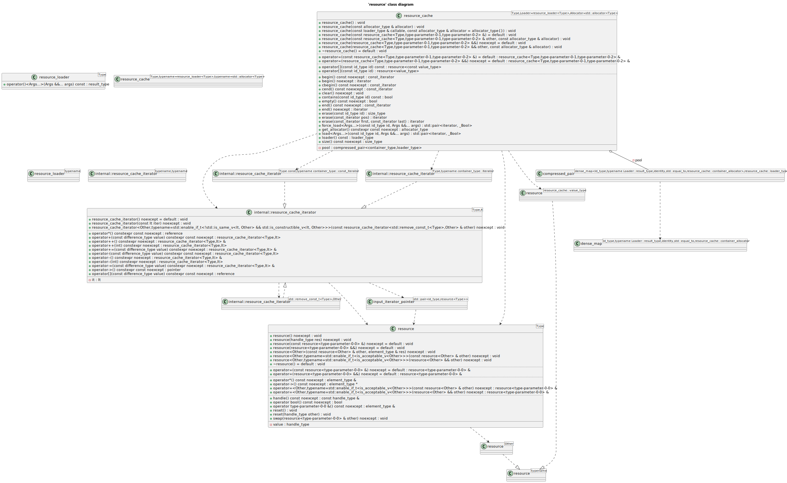

# entt UML diagrams
## 'container' class diagram

## 'core' class diagram

## 'entity' class diagram

## 'graph' class diagram

## 'locator' class diagram

## 'meta' class diagram

## 'poly' class diagram

## 'process' class diagram

## 'resource' class diagram

## 'signal' class diagram

