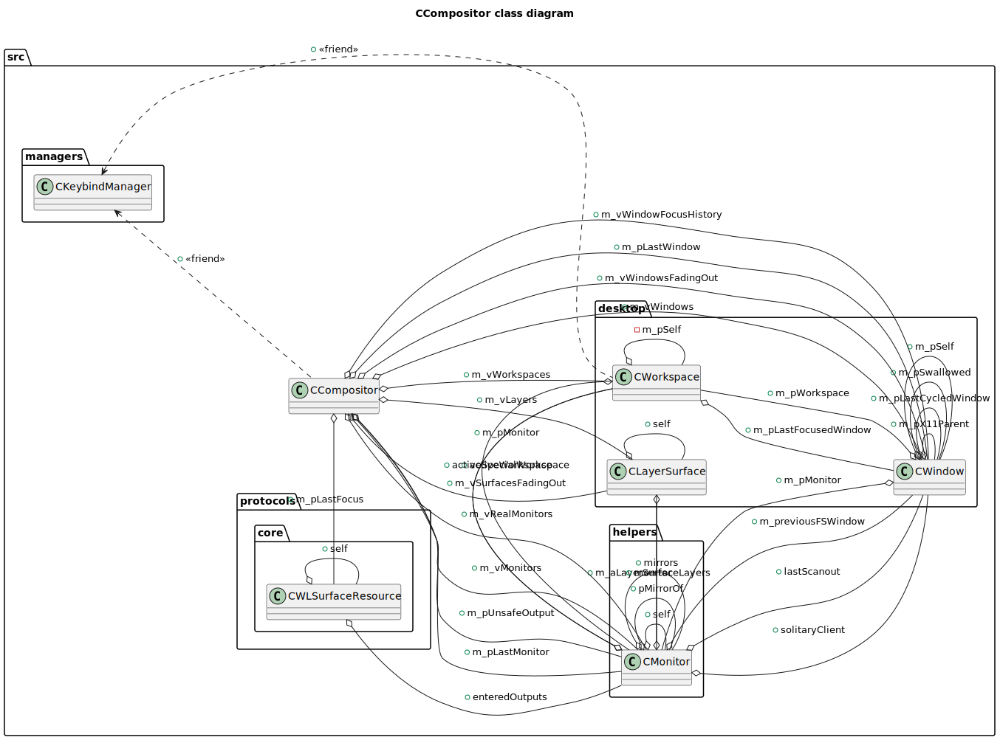
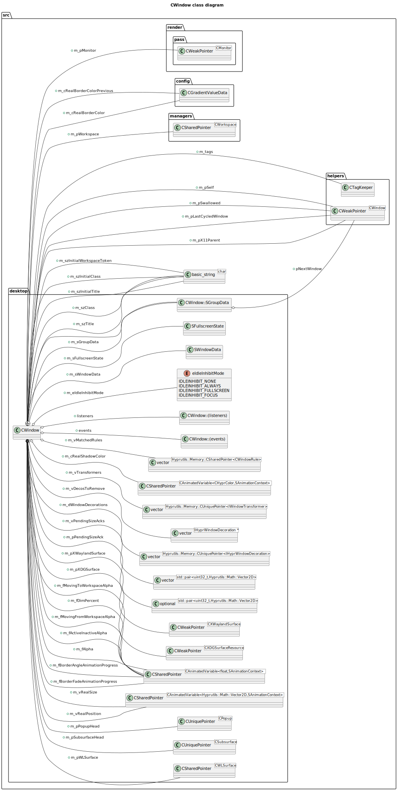
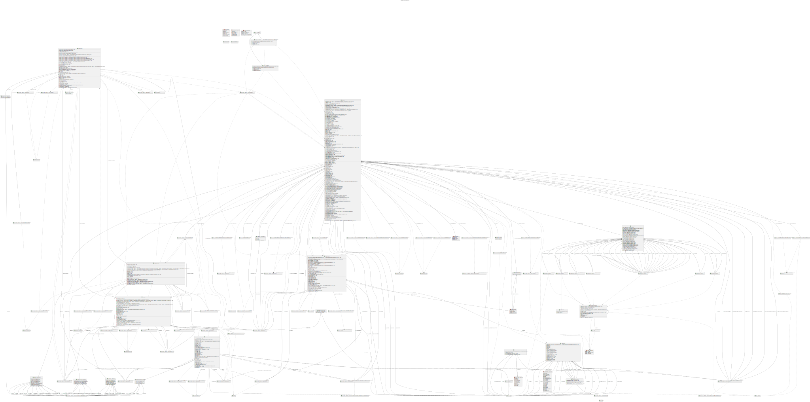
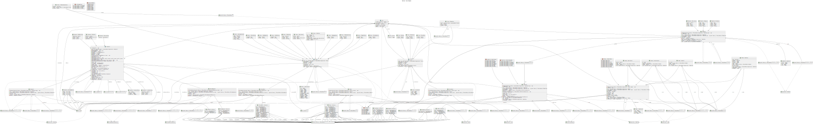
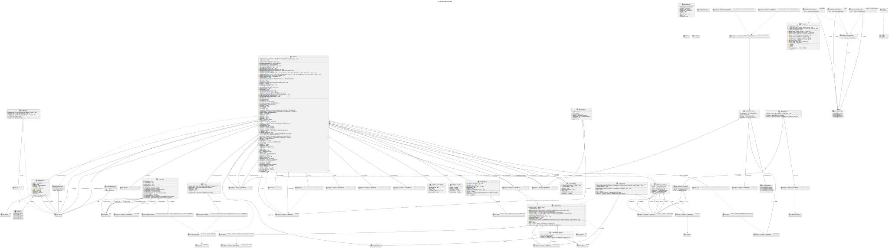
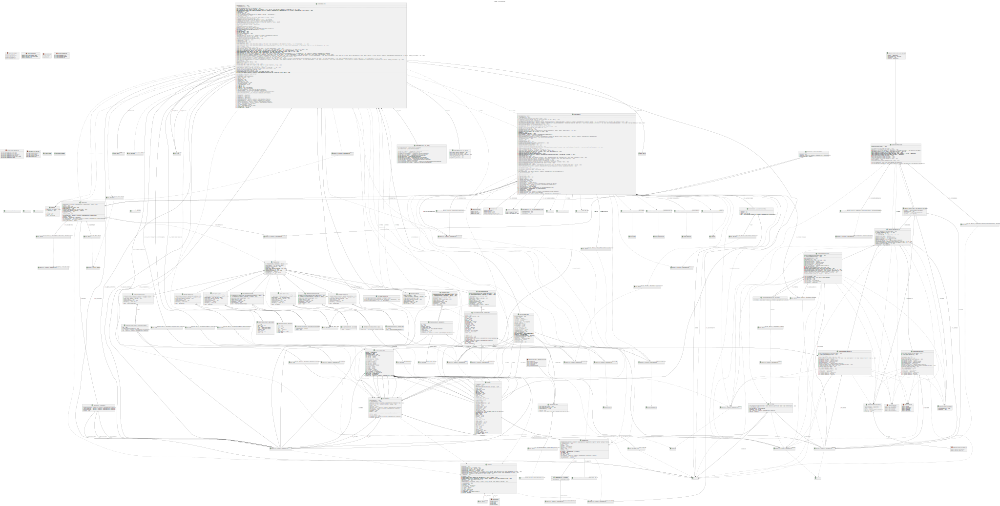
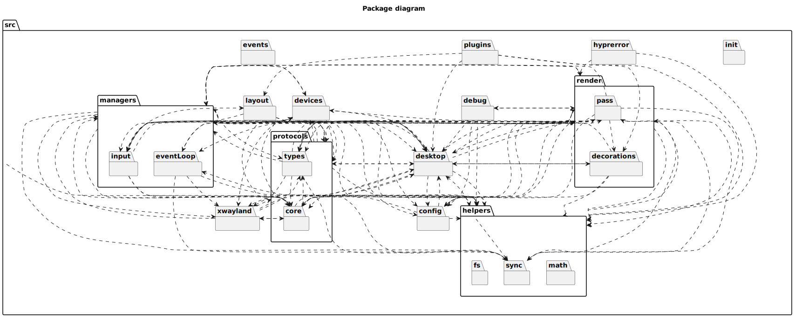

# hyprland UML diagrams
## CCompositor class diagram

## CWindow class diagram

## 'config' class diagram

## 'desktop' class diagram

## 'devices' class diagram

## 'helpers' class diagram

## 'render' class diagram

## Package diagram

