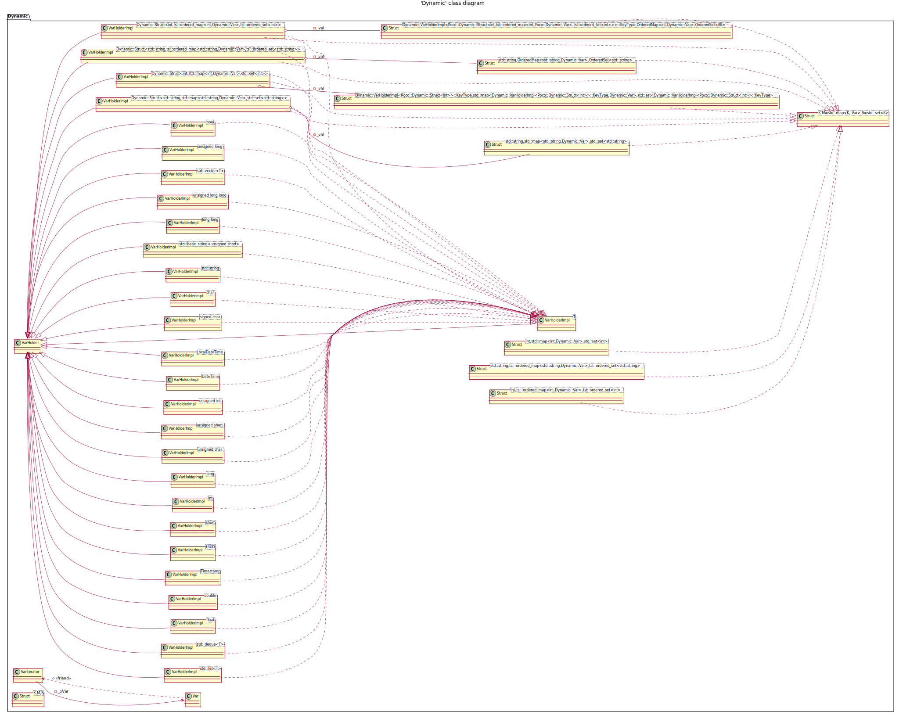
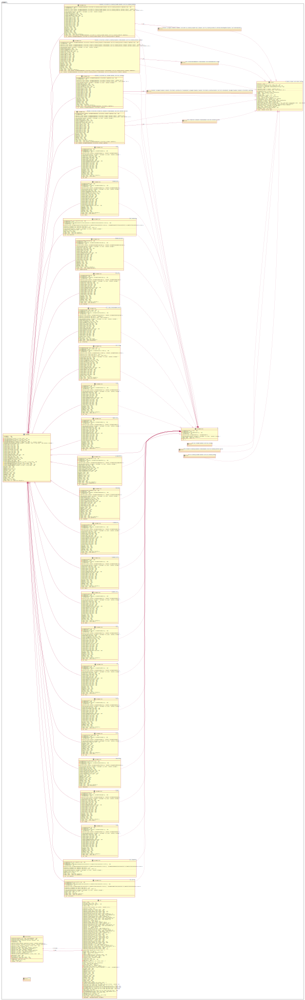
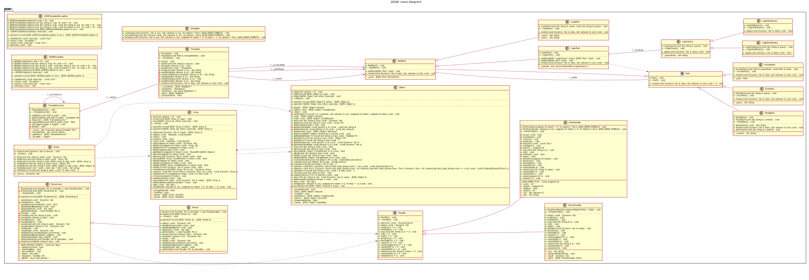

# poco UML diagrams

<!-- toc -->

* ['Foundation' class diagram](#foundation-class-diagram)
* ['Dynamic' class diagram](#dynamic-class-diagram)
* ['Dynamic' class detail diagram](#dynamic-class-detail-diagram)
* ['JSON' class diagram](#json-class-diagram)

<!-- tocstop -->

## 'Foundation' class diagram

## 'Dynamic' class diagram

## 'Dynamic' class detail diagram

## 'JSON' class diagram

